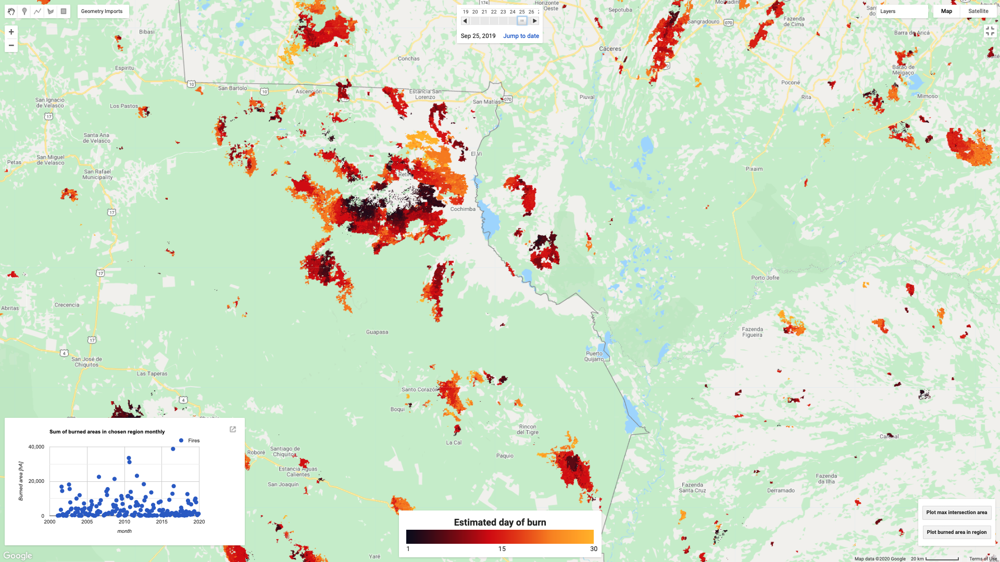
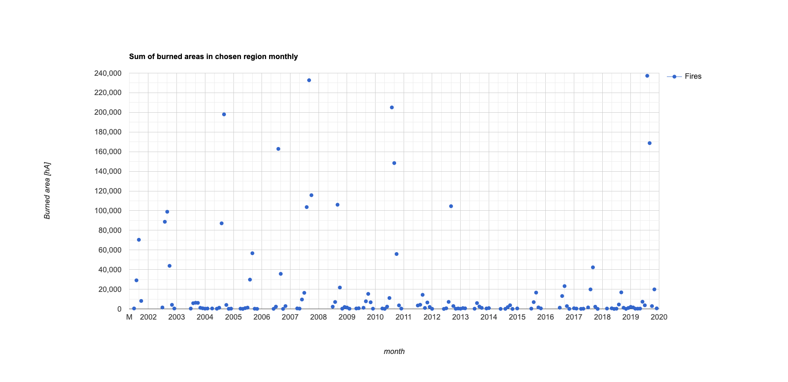
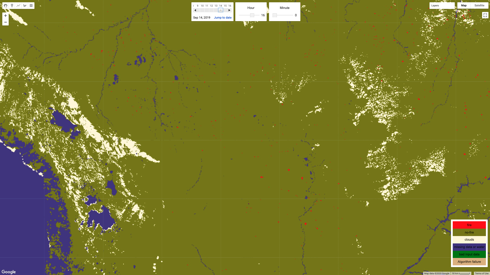

# u8-fire-monitoring

## Introduction 
To understand fire data better, we have developed two apps on top of Google Earth Engine that can serve as fire monitoring tools.  

## Links
Apps can be accessed directly from GEE code editor:
* [ccii-fire-monitoring](https://code.earthengine.google.com/2800c051eaa294bfc3289a42c5c29e92)
* [goes-fire-monitoring](https://code.earthengine.google.com/b4211d34e67fb73d60284962727f930e)

## Applications

### cci-fire-monitoring

Cci-fire-monitoring is built on top of [FireCCI51](https://developers.google.com/earth-engine/datasets/catalog/ESA_CCI_FireCCI_5_1) dataset, but can also be used with [MODIS Burned Area monthly](https://developers.google.com/earth-engine/datasets/catalog/MODIS_006_MCD64A1#description). Check dataset websites for description of spatio-temporal resolution and availability of data.   

The app consist of global map of burned areas with estimated day of burn. User can specify region of interest to plot statistics of the region, namely:
* Burned areas in the region
* Maximum burned area that intersects the region

  
Each option generates a plot with burned areas on Y axis and time on X axis. User can click on specific point to plot burned areas in given month on the map.

### goes-fire-monitoring
Goes-fire-monitoring is built on top of [GOES-16 FDCF](https://developers.google.com/earth-engine/datasets/catalog/NOAA_GOES_16_FDCF) dataset, but can also be used with other fire datasets from GOES satellites. Check dataset websites for description of spatio-temporal resolution and availability of data.

